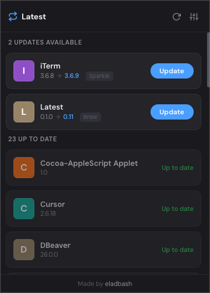
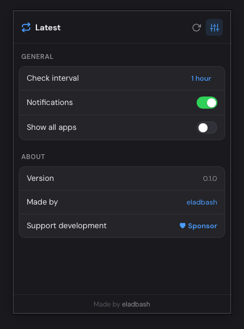

<div align="center">


# Latest

**Keep every Mac app up to date.**

Latest lives in your menu bar and quietly checks for updates across Homebrew, Sparkle, and the Mac App Store — then lets you update with one click.



</div>

## Features

- **Menu bar native** — lives in your tray, out of your way
- **Multiple sources** — checks Homebrew Casks, Sparkle feeds, and the Mac App Store
- **One-click updates** — download and install without leaving the app
- **Auto-check** — configurable intervals from 30 minutes to daily
- **Lightweight** — built with Tauri, minimal resource usage

## Install

```sh
curl -fsSL https://raw.githubusercontent.com/eladbash/latest/main/install.sh | sh
```

Or download the latest `.dmg` from [Releases](https://github.com/eladbash/latest/releases).

## Build from Source

**Prerequisites:** [Rust](https://rustup.rs/), [Node.js](https://nodejs.org/) (v18+), [Tauri CLI](https://v2.tauri.app/start/prerequisites/)

```sh
git clone https://github.com/eladbash/latest.git
cd latest
npm install
npm run build
```

The built app will be in `src-tauri/target/release/bundle/macos/`.

To run in development mode:

```sh
npm run dev
```

## Settings



Configure check intervals, notifications, and ignore specific apps from the settings panel.

## Credits

Made by [eladbash](https://github.com/eladbash)

If you find Latest useful, consider [sponsoring](https://github.com/sponsors/eladbash) the project.

## License

MIT
